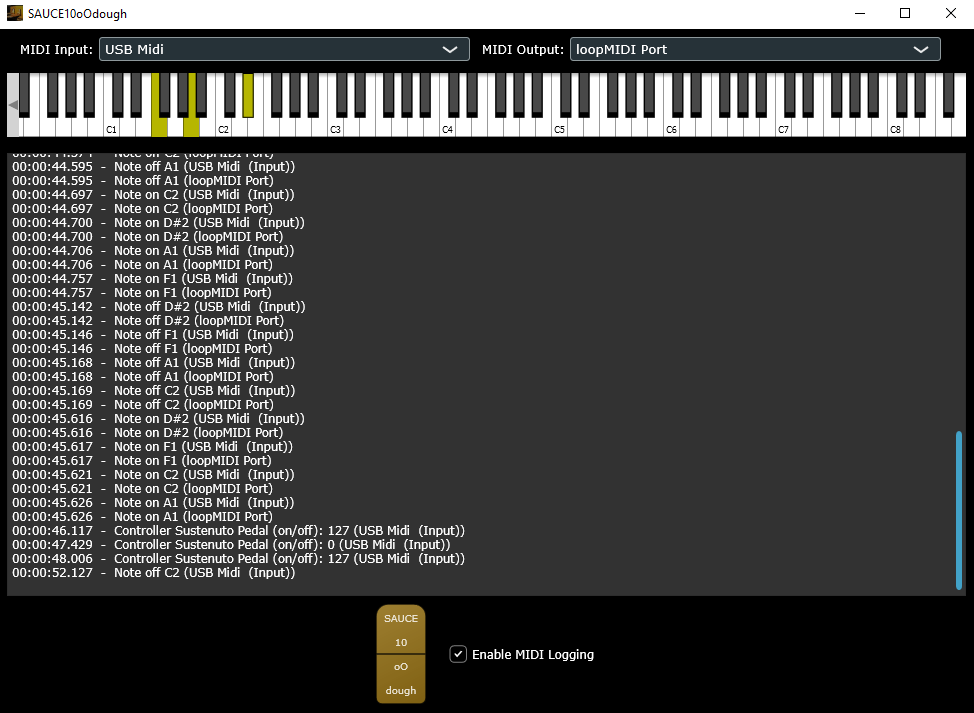

# JUCE MIDI Controller with Sostenuto Pedal

A MIDI processing app built with JUCE that handles MIDI input/output and implements a sostenuto pedal feature in between, with MIDI CC 66

## Features

- **MIDI Input/Output**: Connect to any available MIDI input and output devices
- **On-Screen Keyboard**: Play notes directly from the app interface
- **Sostenuto Pedal**: Emulates a piano's sostenuto pedal functionality
  - When pressed, the sostenuto pedal holds only the notes that are currently being played, allowing staccoto to overlap the sustained notes
  - When released, held notes continue to sound until the pedal is released
- **Efficient Note Tracking**: Uses an optimized bitset algorithm for tracking held notes
- **MIDI Message Logging**: Displays incoming and outgoing MIDI messages with timestamps
- **Virtual Instruments Usually Don't Implement This**: Now there's a way

## Sostenuto Pedal Implementation

The sostenuto pedal works like a piano's middle pedal:

1. When pressed, it captures the state of currently pressed keys
2. Those specific notes will be sustained even after you release the keys
3. New notes played after the pedal is pressed are not affected
4. When the pedal is released, any sustained notes that aren't physically held anymore will stop

This can become important for many advanced classical pieces.

The app uses a high-performance bitset (bitmap) implementation to track which notes are being held by the sostenuto pedal and iterate through the releases in better than O(N), offering better performance than a standard set container or even plain bitset implementations. Further performance improvements might be possible by processing a MIDI buffer instead of handling individual events, but I haven't tested this.

## Technical Details

- Built with JUCE framework
- Uses bitmapped bitset operations for efficient note tracking and release
- Platform-independent implementation for bit manipulation functions

## Installing the Project

- x64 Windows Executable Provided, No Install Necessary
- Currently only Windows standalone installer is implemented
- In `/SAUCE10oOdough/installer` directory.

## Build Requirements

- JUCE 6.0 or higher
- C++14 compatible compiler
- Supported platforms: Windows, macOS, Linux

## Building the Project

1. Open the project in Projucer
2. Generate the project files for your IDE
3. Build the project with your IDE

## Usage

1. Launch the application
2. Select your MIDI input and output devices from the dropdown menus
3. Play notes using your MIDI controller or the on-screen keyboard
4. Use the sostenuto pedal button to hold selected notes

## License

This project is licensed under the ISC license - see the LICENSE file for details.

## Acknowledgements

- Based on JUCE Tutorials
- Copyright (c) 2020 - Raw Material Software Limited

## Possible future improvements

- Custom mapping controls instead of only allowing CC66 or mouse click
- Allowing control to have inverted logic
